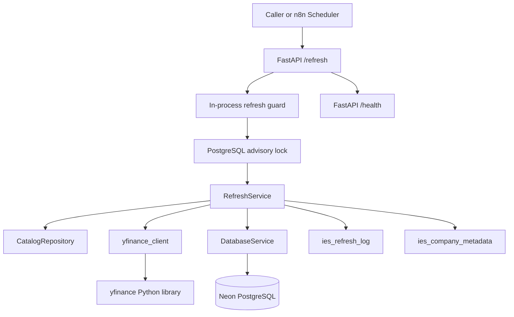
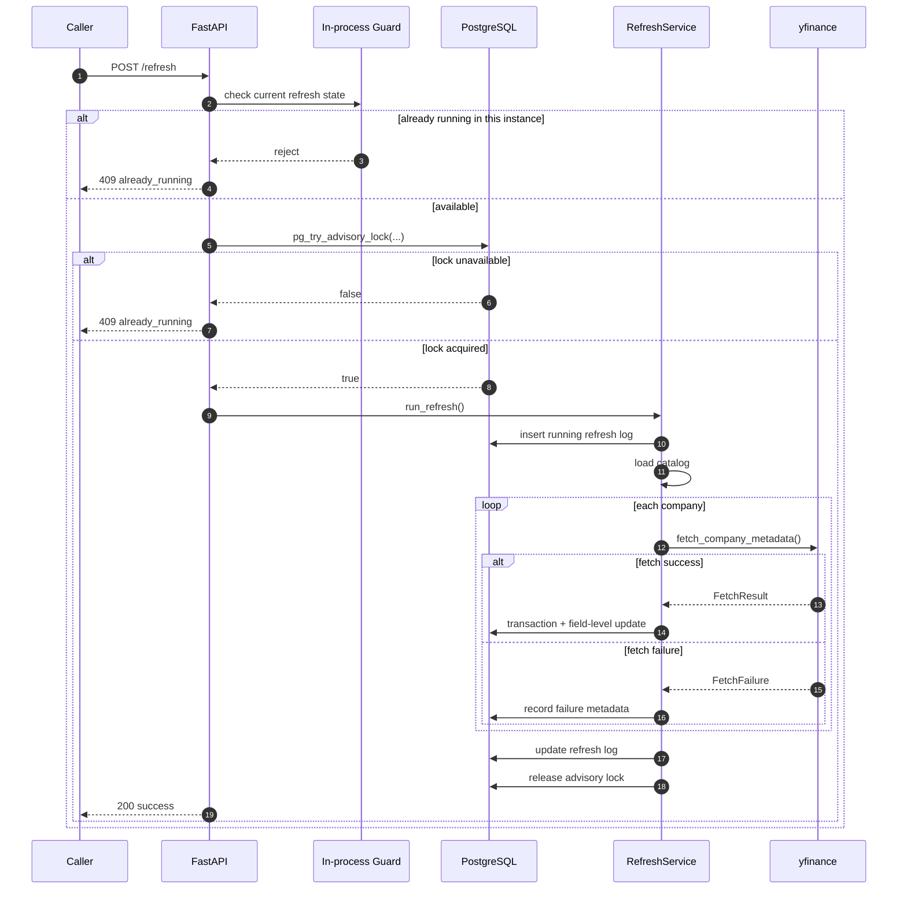

# YFinance Metadata Refresh Service API Documentation

This document describes the current implementation of the independent YFinance Metadata Refresh Service. It is written for internal developers, operators, and future maintainers who need to deploy, monitor, extend, or troubleshoot the service.

The service is intentionally small:
- It loads the bundled IES catalog from disk.
- It fetches lightweight metadata through the official `yfinance` Python library.
- It writes results to Neon PostgreSQL with null-preserving, field-level updates.
- It records every refresh run in an audit log.
- It exposes only two HTTP endpoints: `GET /health` and `POST /refresh`.

## Project Overview

The service refreshes company metadata on a weekly schedule, with the primary goal of improving data quality without ever making valid data worse.

Key design principles:
- A refresh can update a field, skip it, or preserve the existing value.
- Existing valid data is never overwritten with null, empty, or unavailable Yahoo data.
- Each company is processed independently so one failure does not abort the whole run.
- Refreshes are idempotent: repeated runs converge to the same database state unless Yahoo data has actually changed.
- Only one refresh may run at a time.

The service is suitable for:
- Scheduled metadata refreshes from n8n.
- Internal API use by maintainers or ops tooling.
- Production deployments on Docker or Coolify.

## Architecture Overview

### Request Flow

1. An external caller or n8n sends `POST /refresh`.
2. The API checks whether the service is already running a refresh in-process.
3. The service acquires a PostgreSQL advisory lock.
4. The service validates the database and yfinance integration if needed.
5. A refresh log row is inserted with status `running`.
6. The catalog is loaded from `data/ies_catalog.json`.
7. Companies are fetched concurrently with bounded concurrency and retry logic.
8. Each company update is applied in its own database transaction.
9. Per-company failures are recorded, but the refresh continues.
10. After a successful refresh pass, region normalization runs against the persisted metadata and updates only rows whose `region` no longer matches the mapped `country`.
11. The refresh log is updated at the end with the final counts, warnings, and timing.
12. Locks are released and the API returns a final JSON response.

### Component Diagram



### Refresh Sequence Diagram



## Technology Stack

- Python 3.14
- FastAPI
- asyncpg
- yfinance
- Pydantic v2
- Pydantic Settings
- Uvicorn
- PostgreSQL / Neon
- Docker
- n8n for scheduling and orchestration

## Environment Variables

The service reads configuration from environment variables. The current implementation supports:

| Variable | Required | Default | Purpose |
|---|---:|---|---|
| `DATABASE_URL` | Yes | None | Neon PostgreSQL connection string |
| `LOG_LEVEL` | No | `INFO` | Application logging level |
| `CATALOG_PATH` | No | `data/ies_catalog.json` | Path to the bundled company catalog |
| `REFRESH_CONCURRENCY` | No | `8` | Maximum concurrent company fetches |
| `REFRESH_TIMEOUT_SECONDS` | No | `20` | Timeout for a single yfinance fetch |
| `REFRESH_MAX_ATTEMPTS` | No | `3` | Maximum retry attempts for a single fetch |
| `RETRY_BASE_DELAY_SECONDS` | No | `1` | Base delay used for exponential backoff |
| `DB_POOL_MIN_SIZE` | No | `1` | PostgreSQL pool minimum size |
| `DB_POOL_MAX_SIZE` | No | `5` | PostgreSQL pool maximum size |
| `DB_COMMAND_TIMEOUT_SECONDS` | No | `30` | AsyncPG command timeout |
| `STARTUP_VALIDATION_TICKER` | No | `AAPL` | Ticker used by startup validation |

Notes:
- Timestamps are stored as UTC-aware values in PostgreSQL.
- User-facing timestamps are formatted in IST (`Asia/Kolkata`).

## Database Schema

The service creates or preserves the required tables automatically.

### `public.ies_company_metadata`

Purpose: the current company metadata record for each ticker.

| Column | Type | Notes |
|---|---|---|
| `id` | `bigint` | Identity primary key |
| `ticker` | `text` | Unique company ticker |
| `company_name` | `text` | Required, never null |
| `sector` | `text` | Required, defaults to empty string |
| `industry` | `text` | Required, defaults to empty string |
| `country` | `text` | Required, defaults to empty string |
| `region` | `text` | Required, defaults to empty string |
| `exchange` | `text` | Required, defaults to empty string |
| `currency` | `text` | Required, defaults to empty string |
| `revenue_ttm` | `numeric` | TTM revenue |
| `market_cap` | `numeric` | Market capitalization |
| `last_successful_refresh` | `timestamptz` | Time of the last successful refresh for this row |
| `last_refresh_attempt` | `timestamptz` | Time the most recent refresh attempt began |
| `refresh_status` | `text` | Current per-company status (`never`, `success`, `unchanged`, `failed`) |
| `last_error_message` | `text` | Last recorded per-company error |
| `refresh_duration_ms` | `integer` | Duration of the most recent refresh attempt for this company |
| `last_updated` | `timestamptz` | Row update timestamp |

Indexes used by the service:
- `ies_company_metadata_last_updated_idx`
- `ies_company_metadata_last_refresh_attempt_idx`
- `ies_company_metadata_refresh_status_idx`

### `public.ies_refresh_log`

Purpose: audit log for each refresh run.

| Column | Type | Notes |
|---|---|---|
| `run_id` | `uuid` | Primary key |
| `started_at` | `timestamptz` | UTC start timestamp |
| `finished_at` | `timestamptz` | UTC finish timestamp |
| `duration_ms` | `integer` | Run duration in milliseconds |
| `processed` | `integer` | Number of companies in the catalog for the run |
| `inserted` | `integer` | Number of rows inserted |
| `updated` | `integer` | Number of rows updated |
| `skipped` | `integer` | Number of companies that produced no field changes |
| `failed` | `integer` | Number of companies that failed during fetch or DB update |
| `total_api_calls` | `integer` | Total yfinance attempts across the run |
| `validation_warnings` | `integer` | Count of validation warnings raised while processing |
| `field_update_reasons` | `jsonb` | Array of per-field and per-company update reasons |
| `status` | `text` | Run status (`running`, `success`, `partial_failure`, `failed`) |

Indexes used by the service:
- `ies_refresh_log_started_at_idx`
- `ies_refresh_log_status_idx`

## API Endpoints

### `GET /health`

Purpose:
- Basic liveness check for Docker, Coolify, and uptime monitors.

Response:
```json
{
  "status": "ok"
}
```

Notes:
- This endpoint does not validate the database.
- It is intentionally lightweight and always returns `200` when the app process is running.

### `POST /refresh`

Purpose:
- Run a full metadata refresh for the bundled catalog.

Behavior:
- Checks the local in-process refresh guard.
- Checks the PostgreSQL advisory lock.
- Validates the system if startup validation was not already completed successfully.
- Writes a refresh log row.
- Fetches companies concurrently with retries.
- Updates only changed fields.
- Preserves existing data when Yahoo returns null, empty, or unusable values.
- Continues processing remaining companies if one ticker fails.

Success response fields:
- `status`
- `run_id`
- `started_at_ist`
- `finished_at_ist`
- `processed`
- `inserted`
- `updated`
- `skipped`
- `failed`
- `total_api_calls`
- `validation_warnings`
- `duration_seconds`
- `message`

Important:
- If some companies fail but the refresh completes, the API still returns `200 OK` with `status: "success"`.
- In that case, the `failed` counter can be greater than zero and `public.ies_refresh_log.status` is typically `partial_failure`.

### Other Endpoints

At the moment, there are no other application endpoints beyond `/health` and `/refresh`.

## Request & Response Examples

### `GET /health`

Request:
```http
GET /health HTTP/1.1
Host: localhost:8000
```

Response:
```json
{
  "status": "ok"
}
```

### `POST /refresh` success

Request:
```http
POST /refresh HTTP/1.1
Host: localhost:8000
Content-Type: application/json
```

Response:
```json
{
  "status": "success",
  "run_id": "7d1b2d04-5d6a-4fcb-9d0f-f2b7c9e6d8a5",
  "started_at_ist": "30 May 2026, 12:30 PM IST",
  "finished_at_ist": "30 May 2026, 12:34 PM IST",
  "processed": 145,
  "inserted": 3,
  "updated": 41,
  "skipped": 101,
  "failed": 0,
  "total_api_calls": 162,
  "validation_warnings": 2,
  "duration_seconds": 243.821,
  "message": "Metadata refresh completed successfully"
}
```

### `POST /refresh` already running

Response:
```http
HTTP/1.1 409 Conflict
Content-Type: application/json
```

```json
{
  "status": "already_running",
  "message": "A metadata refresh is already in progress."
}
```

### `POST /refresh` service validation failure

If startup validation or on-demand validation fails, the service returns `503`.

Example:
```json
{
  "status": "failed",
  "run_id": null,
  "started_at_ist": null,
  "finished_at_ist": null,
  "processed": 0,
  "inserted": 0,
  "updated": 0,
  "skipped": 0,
  "failed": 0,
  "total_api_calls": 0,
  "validation_warnings": 0,
  "duration_seconds": 0.0,
  "message": "Service validation failed: Required tables are missing"
}
```

### `POST /refresh` run with company-level failures

If some companies fail but the run completes, the API still returns `200 OK` with `status: "success"`.

Example:
```json
{
  "status": "success",
  "run_id": "8c2e16b9-66ff-4bc8-9c4a-3f0fbc0d4b63",
  "started_at_ist": "30 May 2026, 03:00 PM IST",
  "finished_at_ist": "30 May 2026, 03:08 PM IST",
  "processed": 145,
  "inserted": 2,
  "updated": 39,
  "skipped": 102,
  "failed": 2,
  "total_api_calls": 149,
  "validation_warnings": 1,
  "duration_seconds": 489.114,
  "message": "Metadata refresh completed successfully"
}
```

## Refresh Workflow

### Lifecycle

1. The request enters `POST /refresh`.
2. The service checks whether a refresh is already active in the current process.
3. The service acquires the PostgreSQL advisory lock.
4. The service validates the database schema and yfinance integration if required.
5. A `running` row is inserted into `public.ies_refresh_log`.
6. The bundled catalog is loaded.
7. Companies are fetched in bounded concurrent batches.
8. For each company:
   - a fetch is attempted with retry logic,
   - the database row is updated in a transaction,
   - per-company failure metadata is recorded if fetch or write fails.
9. If the refresh completes successfully, the service performs a separate region normalization pass that updates only rows with an incorrect `region`.
10. The refresh log is updated with final counts and status.
11. The advisory lock is released.
12. The in-process guard is released.
13. The API returns the final summary.

### Important implementation detail

The service uses two lock layers:
- An in-process `asyncio.Lock` for fast fail behavior within a single running instance.
- A PostgreSQL advisory lock for cross-process / cross-container protection.

## Smart Update Logic

The service uses null-preserving, field-level updates.

### General rules

- If the existing value is `NULL`, the fetched value may replace it.
- If the fetched value is `NULL`, the existing value is preserved.
- If both values are equal, the field is skipped.
- If the fetched value differs, the field is updated.
- Required text columns on insert are populated with safe non-null values so schema constraints are respected.

### Text fields

The service currently manages these text fields:
- `company_name`
- `sector`
- `industry`
- `country`
- `region`
- `exchange`
- `currency`

Normalization rules:
- Leading and trailing whitespace is stripped.
- Empty strings are treated as unavailable.
- Null Yahoo values never overwrite valid existing values.

### Numeric fields

The service currently manages these numeric fields:
- `revenue_ttm`
- `market_cap`

Numeric rules:
- Null fetched values are ignored.
- Negative numeric values are skipped and counted as validation warnings.
- `market_cap <= 0` is skipped and counted as a validation warning.
- If the fetched numeric value differs from the existing value, the field is updated.
- The update reason is recorded as `field_empty`, `data_changed`, or `newer_information`.

### Field update reasons

Examples stored in the audit log:
- `ABC.revenue_ttm:field_empty`
- `ABC.market_cap:newer_information`
- `ABC.sector:data_changed`

## Refresh Locking Using PostgreSQL Advisory Locks

The service uses a single advisory lock key derived from a stable hash:
- `REFRESH_LOCK_KEY`

Behavior:
- `pg_try_advisory_lock(...)` is used to avoid blocking.
- If the lock cannot be acquired, the API returns `409 Conflict`.
- The advisory lock is released after the run completes or fails.

Why this matters:
- It prevents overlapping execution across multiple containers or restarts.
- It allows the scheduler to retry later without corrupting state.

## Retry Logic and Failure Handling

Retry behavior is implemented in `app/yfinance_client.py`.

### Retryable failures

The service retries exceptions that look transient, such as:
- timeouts
- connection resets
- connection refusals
- temporary service failures
- rate limiting
- 502 / 503 / 504-like failures

### Non-retryable failures

The service stops retrying early for errors that look permanent, such as:
- ticker not found
- no data found
- possibly delisted
- invalid ticker
- does not exist

### Backoff

The delay grows exponentially:
- attempt 1 -> no delay before the retry
- attempt 2 -> `base_delay * 2`
- attempt 3 -> `base_delay * 4`
- and so on

### Failure handling

- A failed company does not abort the whole refresh.
- The existing company values are preserved.
- The failure is recorded in the per-company tracking fields.
- The refresh continues with the next company.

## Audit Logging and Refresh Tracking

Every refresh run writes a row into `public.ies_refresh_log`.

Tracked fields:
- run ID
- start time
- finish time
- duration
- processed count
- inserted count
- updated count
- skipped count
- failed count
- total API calls
- validation warnings
- field update reasons

Per-company tracking fields:
- `last_successful_refresh`
- `last_refresh_attempt`
- `refresh_status`
- `last_error_message`
- `refresh_duration_ms`

### Refresh log status values

- `running`
- `success`
- `partial_failure`
- `failed`

### Per-company status values

- `never`
- `success`
- `unchanged`
- `failed`

## Timezone Handling

### Storage

Internally:
- Datetimes are handled as UTC-aware values.
- PostgreSQL columns use `timestamptz`.

### Display

Externally:
- User-facing timestamps are formatted in IST (`Asia/Kolkata`).
- The API never returns raw UTC timestamps in its normal refresh response.

### Display format

The service uses a consistent format similar to:

```text
30 May 2026, 12:30 PM IST
```

## Error Codes and HTTP Responses

| Status | Meaning | Typical cause |
|---|---|---|
| `200 OK` | Refresh completed successfully | No blocking issues, run finished |
| `409 Conflict` | Refresh already running | In-process or advisory lock already held |
| `500 Internal Server Error` | Refresh crashed | Unexpected exception during the run |
| `503 Service Unavailable` | Validation failed | DB/schema/yfinance validation could not complete |

### Notable response shapes

`409 Conflict`:
```json
{
  "status": "already_running",
  "message": "A metadata refresh is already in progress."
}
```

`503` and `500` responses use the `RefreshResponse` shape with `status: failed`.

## Deployment Guide

### Docker

Build:
```bash
docker build -t ies-metadata-refresh .
```

Run:
```bash
docker run --rm -p 8000:8000 --env-file .env ies-metadata-refresh
```

The service listens on port `8000` by default in the provided Docker setup.

### Docker Compose

If using the included compose file:
```bash
docker compose up --build
```

### Coolify

1. Create a new service from this repository.
2. Use the Dockerfile build type.
3. Set `DATABASE_URL`.
4. Set any optional tuning variables you need.
5. Expose port `8000`.
6. Configure the health check path as `/health`.
7. Deploy.

Recommended Coolify health check:
- Path: `/health`
- Port: `8000`

## Scheduling with n8n

The intended schedule is weekly on Saturday at 3:00 PM IST.

Recommended n8n workflow:

1. Use a Cron or Schedule Trigger.
2. Configure it for Saturday at 15:00 Asia/Kolkata.
3. Add an HTTP Request node with `POST /refresh`.
4. Set a timeout longer than the expected run time.
5. Treat `200` with `status === "success"` and `failed === 0` as success.
6. Treat `409` as "already running" rather than as a service crash.
7. Optionally route the response to Slack, email, or a log sink.

Suggested scheduler behavior:
- If the service returns `409`, skip the run and retry at the next scheduled execution.
- If the service returns `503`, investigate the service health or database connectivity.
- If the service returns `500`, inspect the error and refresh log row.

## Production Safety Features

The current implementation is designed to be safe under real production conditions.

### Included safeguards

- Null-preserving updates
- Field-level updates instead of whole-row replacement
- Per-company transactions
- Rollback on failed company updates
- Cross-process advisory locking
- In-process overlap guard
- Concurrent fetches with bounded concurrency
- Retry logic for transient yfinance failures
- Per-company error recording
- Run-level audit logging
- UTC storage with IST display formatting
- Validation warnings for suspicious numeric values

### Idempotency guarantees

Repeated refreshes do not reduce data completeness.
Repeated runs only change the database when Yahoo data actually differs or when a field was previously empty.

### Validation rules

The service rejects or skips updates that would reduce data quality, including:
- replacing a valid value with `NULL`
- replacing a valid market cap with `0`
- accepting negative numeric values

## Troubleshooting Guide

### `409 already_running`

Meaning:
- Another refresh is active in the same process or another process holds the advisory lock.

Action:
- Wait for the current run to complete.
- Check the audit log for the active run.

### `503 Service validation failed`

Meaning:
- Startup validation or on-demand validation could not complete.

Common causes:
- missing or invalid `DATABASE_URL`
- missing tables or schema mismatch
- yfinance validation ticker failed

Action:
- Check database connectivity.
- Verify the tables exist.
- Review startup logs.

### `500 Metadata refresh crashed`

Meaning:
- An unexpected exception occurred while processing the run.

Action:
- Inspect the error message in the response.
- Review the application logs.
- Check the audit log row for the run ID.

### Rows are not updating as expected

Possible causes:
- Yahoo returned null or incomplete values, so existing data was preserved.
- The fetched value matched the existing value, so the field was skipped.
- A numeric value was rejected as invalid or suspicious.

Action:
- Check the `validation_warnings` count and `field_update_reasons`.
- Review the per-company status and last error columns.

### Refresh appears slow

Possible causes:
- Yahoo response latency
- Retry backoff
- Database contention

Action:
- Review `total_api_calls`.
- Review `duration_ms` in the refresh log.
- Adjust concurrency carefully if needed.

### Timestamps look wrong

Remember:
- Storage is UTC-aware.
- API output is IST-formatted.

If a direct SQL query shows UTC, that is expected.

## Future Enhancement Roadmap

The following items are not implemented yet, but they would be natural next steps:

1. Add a read-only API to query refresh history and per-company tracking records.
2. Add structured metrics export for Prometheus or OpenTelemetry.
3. Add alerting hooks for repeated validation failures.
4. Add a retention policy for old refresh logs.
5. Add field provenance history for deeper auditing.
6. Add a forced refresh endpoint for manual ops use.
7. Add a dead-man / stale lock cleanup policy if deployment topology ever requires it.
8. Add richer dashboards for row-level coverage and warning trends.

These are roadmap ideas only. They are not part of the current implementation.

## Notes for Maintainers

- The service currently exposes only `GET /health` and `POST /refresh`.
- The catalog is local and is not fetched from a remote service at runtime.
- The refresh path depends on the official `yfinance` Python package.
- The implementation intentionally avoids raw Yahoo scraping.
- Startup validation failures are logged, and refresh validation is re-attempted on the first request if needed.
